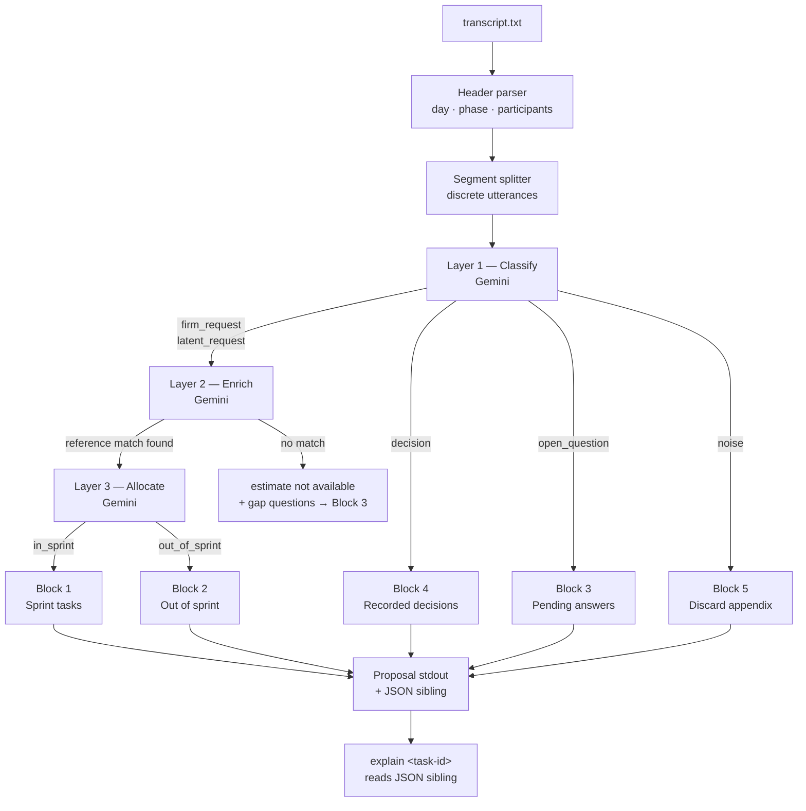

# Sprint Composer

> CLI agent that turns a raw client meeting transcript into a structured 5-block sprint-plan proposal the FDE Lead can approve in under 10 minutes.


---

## TL;DR

| | |
|---|---|
| **Problem** | After a 60-minute client meeting, FDEs reconstruct a sprint plan by feel — effort guesses, silently dropped decisions, open questions buried in task lists |
| **Solution** | Three sequential Gemini-powered judgment layers classify, enrich, and allocate every transcript segment into a 5-block structured proposal |
| **Stack** | Python 3.11, Google Gemini API, uv, argparse |
| **Result** | Transcript → Lead-approved proposal in ≤10 minutes (vs. ~3 hours today) |

---

## Why this exists

Khal FDEs operate inside a tight 15-day delivery cycle (Discovery → Setup → Simulation → Go-live) serving enterprise clients across healthcare, fintech, retail, and BPO. After every alignment meeting they return to a blank canvas holding a transcript that mixes firm requests, latent pains, decisions, open questions, and irrelevant noise. Manually separating and estimating these items is artisanal and error-prone — omissions at the start of the cycle compound into deviations at delivery. The FDE Lead either spends ~2 hours reworking the proposal or rejects it entirely. Sprint Composer makes that manual reconstruction unnecessary.

---

## What it does

| Need | Solution |
|---|---|
| FDE needs a structured proposal without re-reading every line | `run` classifies every segment and emits a 5-block proposal to stdout |
| Lead needs confidence levels to approve quickly | Every item carries `HIGH / MEDIUM / LOW` confidence with an explicit reason |
| Effort must never be fabricated | No reference match → effort is exactly `"estimate not available"` + concrete unblocking questions |
| Decisions and questions must not pollute the task list | Non-task segments route to their own output blocks; nothing is silently dropped |
| Phase context must drive allocation | Items out of phase for Khal's 15-day cycle land in "Out of sprint" with a justification |
| Any item must be auditable on demand | `explain <task-id>` shows the verbatim source excerpt + full classification path |

---

## Architecture



> **Note** — "Block N" labels correspond to the five output sections printed by `sprint-composer run`. The JSON sibling written alongside the proposal is what `explain` reads for auditability.

| Component | Technology | Role |
|---|---|---|
| Header + body parser | `transcript.py` | Extracts `day`, `phase`, `participants` and splits body into segments |
| Layer 1 | Gemini via `google-generativeai` | Classifies each segment as `firm_request`, `latent_request`, `decision`, `open_question`, or `noise` |
| Layer 2 | Gemini + `reference_bank.json` | Enriches requests with historical effort; emits `"estimate not available"` + gap questions when no match |
| Layer 3 | Gemini | Assigns MoSCoW, sprint allocation, dependency order; flags `"needs Lead decision"` when uncertain |
| CLI | `argparse` | Orchestrates the pipeline, formats the 5-block proposal, writes the JSON sibling |
| Fixtures | `src/fixtures/` | Synthetic transcript, taxonomy template, and reference bank — all owned in-repo |

---

## How it was built

**Three-layer sequential pipeline instead of a single prompt** — each layer has a narrow, testable contract. Layer 1 only classifies; it never estimates. Layer 2 only enriches against the reference bank; it never allocates. Layer 3 only assigns priority and phase fit; it never re-classify. This separation means each layer can be tested in isolation against a deterministic fixture and replaced independently.

**`"estimate not available"` is a first-class value, not a fallback string** — the business rule is enforced at the model boundary: the Layer 2 prompt is instructed to produce this exact string and a list of gap questions when the reference bank yields no close match. Downstream code checks for it by string equality; there is no inference about what "low confidence" might mean.

**JSON sibling written alongside every `run`** — the proposal is human-readable stdout; the sibling is the machine-readable audit trail. `explain` reads the sibling, not re-runs the pipeline, so its output is deterministic and matches exactly what the proposal showed.

**Gemini chosen over OpenAI** — the project targets Khal's existing Google Cloud footprint. `google-generativeai>=0.7` is the single runtime dependency; no framework (LangChain, LangGraph) was added because the pipeline is strictly sequential and the added abstraction would outweigh the benefit.

**Synthetic fixtures committed to the repo** — the reference bank contains 4–5 fictitious past projects with recorded effort and blockers. This means the demo runs offline (no customer data required) and the test suite has a stable baseline to grade Layer 1 typology against.

**What is deliberately out of scope for v0** — real (non-synthetic) reference bank, multi-meeting aggregation, Jira/ClickUp integrations, live audio ingestion, web UI. The 15-day cycle demo is the only delivery target.

---

## Repo layout

```
src/
  fixtures/
    transcript.txt          # synthetic meeting transcript for demo + tests
    transcript.json         # taxonomy template — expected Layer-1 type per segment
    reference_bank.json     # fictitious past projects with effort + blockers
  sprint_composer/
    models.py               # shared dataclasses and enums (SegmentType, Confidence, MoSCoW …)
    transcript.py           # header + body parser
    layer1.py               # typology classification via Gemini
    layer2.py               # enrichment against reference bank via Gemini
    layer3.py               # MoSCoW + sprint allocation via Gemini
    cli.py                  # argparse entry point, proposal formatter, explain formatter
tests/
  test_fixtures.py          # reference bank + transcript structure contracts
  test_transcript.py        # header parser + body splitter
  test_layer1.py            # classification output shape + confidence labels
  test_layer2.py            # enrichment contracts (match / no-match paths)
  test_layer3.py            # MoSCoW + allocation + dependency ordering
  test_cli.py               # proposal formatter + explain formatter (unit, no LLM calls)
docs/
  specs/sprint-composer.md  # product SPEC — problem, success metrics, user stories
  plans/sprint-composer.md  # task plan — T01 → T06 with acceptance criteria
  tech-specs/               # per-task implementation contracts
```

---

## Running it

**Install**
```bash
uv sync
```

**Set the API key**
```bash
cp .env.example .env
# edit .env and set GEMINI_API_KEY=<your-key>
```

**Run the pipeline**
```bash
sprint-composer run src/fixtures/transcript.txt
```

**Audit a task**
```bash
sprint-composer explain src/fixtures/transcript.txt S03
```

**Tests**
```bash
uv run pytest tests/ -v          # 6 test files
```

**Lint + type-check**
```bash
uv run ruff check src/ tests/
uv run mypy src/
```

---

## CLI reference

| Command | What it does |
|---|---|
| `sprint-composer run <transcript>` | Runs L1 → L2 → L3, prints the 5-block proposal to stdout, writes a JSON sibling next to the transcript |
| `sprint-composer explain <transcript> <task-id>` | Reads the JSON sibling and prints the verbatim source excerpt, L1 classification, L2 enrichment, and L3 allocation for a single task |

Progress lines (`Layer 1: classifying…` etc.) are emitted to stderr so stdout stays clean for the proposal.

---

## Docs

| Document | Path |
|---|---|
| Product spec | `docs/specs/sprint-composer.md` |
| Implementation plan (T01–T06) | `docs/plans/sprint-composer.md` |
| Per-task tech specs | `docs/tech-specs/` |
